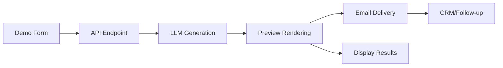

# Self-Serve Demo Implementation Guide

## Overview
Transform Persimmon Labs' website into a lead-generation powerhouse with an instant AI demo that creates real social media content in 15 seconds.

**Goal**: Visitor → Configure demo → Get 3 AI-generated posts → Email capture → Book call/trial

## Architecture



## Phase 1: Core Demo Flow (Days 1-2)

### 1.1 Update Demo Form Component

**File**: `components/sections/DemoGeneratorSection.tsx`

**Required Fields**:
```typescript
interface DemoFormData {
  // Required
  brandName: string;        // Company/brand name
  email: string;           // Email for delivery
  industry: string;        // Dropdown selection
  tone: 'professional' | 'friendly' | 'playful' | 'bold';
  platforms: ('instagram' | 'linkedin' | 'twitter' | 'facebook')[];
  
  // Optional
  imageUrls?: string[];    // Uploaded assets (Phase 2)
  website?: string;        // For additional context
  consent: boolean;        // Marketing consent checkbox
}
```

**Industry Options**:
- E-commerce
- SaaS/Technology
- Marketing Agency
- Fitness/Wellness
- Restaurant/Food
- Professional Services
- Real Estate
- Healthcare
- Education
- Other (with text input)

### 1.2 Demo Generation API Endpoint

**File**: `app/api/demo/generate/route.ts`

```typescript
export async function POST(request: Request) {
  const data = await request.json();
  
  // 1. Validate inputs
  validateDemoRequest(data);
  
  // 2. Check rate limits
  await checkRateLimit(data.email, request.ip);
  
  // 3. Generate unique demo ID
  const demoId = generateDemoId();
  
  // 4. Create brand brief
  const brandBrief = await generateBrandBrief(data);
  
  // 5. Generate content in parallel
  const content = await Promise.all(
    data.platforms.map(platform => 
      generatePlatformContent(platform, brandBrief)
    )
  );
  
  // 6. Store in database
  await saveDemoToSupabase(demoId, data, content);
  
  // 7. Queue email delivery
  await queueEmailDelivery(demoId, data.email);
  
  // 8. Return results
  return Response.json({
    demoId,
    content,
    shareableLink: `${process.env.NEXT_PUBLIC_URL}/demo/${demoId}`
  });
}
```

### 1.3 LLM Integration

**File**: `lib/ai/content-generator.ts`

```typescript
import OpenAI from 'openai';

const openai = new OpenAI({
  apiKey: process.env.OPENAI_API_KEY
});

export async function generateBrandBrief({
  brandName,
  industry,
  tone
}: DemoFormData): Promise<BrandBrief> {
  const prompt = `
    Create a brand brief for ${brandName} in the ${industry} industry.
    Tone: ${tone}
    
    Return JSON with:
    - voice_traits: 3-5 brand voice characteristics
    - target_audience: Brief description
    - key_messages: 3 main points to emphasize
    - hashtag_style: How to use hashtags
    - cta_examples: 2 sample CTAs
  `;
  
  const response = await openai.chat.completions.create({
    model: 'gpt-3.5-turbo',
    messages: [{ role: 'system', content: prompt }],
    temperature: 0.7,
    max_tokens: 500
  });
  
  return JSON.parse(response.choices[0].message.content);
}

export async function generatePlatformContent(
  platform: string,
  brandBrief: BrandBrief
): Promise<PlatformContent> {
  const prompts = {
    instagram: `Create Instagram post: 
      - Hook (first line, <125 chars)
      - Body (3-4 lines with emojis)
      - 5-8 relevant hashtags
      - CTA line
      Keep under 2200 chars total.`,
    
    linkedin: `Create LinkedIn post:
      - Professional hook
      - 3-4 short paragraphs
      - Thought leadership angle
      - 1-3 hashtags max
      - Professional CTA`,
    
    twitter: `Create Twitter/X post:
      - Single tweet (max 280 chars)
      - Punchy, shareable
      - 1-2 hashtags if space
      - Include compelling stat or question`,
    
    facebook: `Create Facebook post:
      - Engaging question or statement
      - 2-3 paragraphs
      - Conversational tone
      - 3-5 hashtags
      - Clear CTA with link`
  };
  
  const response = await openai.chat.completions.create({
    model: 'gpt-3.5-turbo',
    messages: [
      { 
        role: 'system', 
        content: `Brand brief: ${JSON.stringify(brandBrief)}` 
      },
      { 
        role: 'user', 
        content: prompts[platform] 
      }
    ],
    temperature: 0.8,
    max_tokens: 400
  });
  
  return parseContent(response.choices[0].message.content);
}
```

## Phase 2: Visual Previews (Days 2-3)

### 2.1 Platform Preview Components

**File**: `components/previews/InstagramPreview.tsx`

```typescript
export function InstagramPreview({ content }: { content: InstagramContent }) {
  return (
    <div className="instagram-preview bg-white rounded-lg shadow-lg p-4 max-w-sm">
      {/* Header */}
      <div className="flex items-center mb-3">
        <div className="w-10 h-10 bg-gradient-to-r from-persimmon-coral to-persimmon-orange rounded-full" />
        <div className="ml-3">
          <div className="font-semibold text-sm">{content.brandName}</div>
          <div className="text-xs text-gray-500">Sponsored</div>
        </div>
      </div>
      
      {/* Image placeholder */}
      <div className="aspect-square bg-gradient-to-br from-gray-100 to-gray-200 rounded-lg mb-3 flex items-center justify-center">
        <span className="text-gray-400">Your image here</span>
      </div>
      
      {/* Caption */}
      <div className="text-sm">
        <p className="whitespace-pre-wrap">{content.caption}</p>
        <p className="text-blue-500 mt-2">{content.hashtags.join(' ')}</p>
      </div>
      
      {/* Actions */}
      <div className="flex items-center mt-3 text-gray-500">
        <Heart className="w-5 h-5 mr-3" />
        <MessageCircle className="w-5 h-5 mr-3" />
        <Send className="w-5 h-5" />
      </div>
    </div>
  );
}
```

### 2.2 HTML to Image Rendering

**Option A: Client-side (Quick MVP)**

```typescript
import html2canvas from 'html2canvas';

export async function downloadPreview(elementId: string, filename: string) {
  const element = document.getElementById(elementId);
  const canvas = await html2canvas(element);
  
  // Convert to blob and download
  canvas.toBlob((blob) => {
    const url = URL.createObjectURL(blob);
    const a = document.createElement('a');
    a.href = url;
    a.download = `${filename}.png`;
    a.click();
  });
}
```

**Option B: Server-side (Better quality)**

```typescript
// app/api/preview/render/route.ts
import { chromium } from 'playwright';

export async function POST(request: Request) {
  const { html, platform } = await request.json();
  
  const browser = await chromium.launch();
  const page = await browser.newPage();
  
  // Set viewport for platform
  const viewports = {
    instagram: { width: 400, height: 600 },
    linkedin: { width: 550, height: 400 },
    twitter: { width: 500, height: 300 },
    facebook: { width: 500, height: 400 }
  };
  
  await page.setViewportSize(viewports[platform]);
  await page.setContent(html);
  
  const screenshot = await page.screenshot({ 
    type: 'png',
    fullPage: false 
  });
  
  await browser.close();
  
  // Upload to Supabase Storage
  const url = await uploadToSupabase(screenshot, `preview-${Date.now()}.png`);
  
  return Response.json({ previewUrl: url });
}
```

## Phase 3: Storage & Email Delivery (Days 3-4)

### 3.1 Supabase Schema

```sql
-- demos table
CREATE TABLE demos (
  id UUID DEFAULT gen_random_uuid() PRIMARY KEY,
  email TEXT NOT NULL,
  brand_name TEXT NOT NULL,
  industry TEXT NOT NULL,
  tone TEXT NOT NULL,
  platforms TEXT[] NOT NULL,
  status TEXT DEFAULT 'processing',
  public_token TEXT UNIQUE DEFAULT gen_random_uuid(),
  created_at TIMESTAMP WITH TIME ZONE DEFAULT NOW(),
  completed_at TIMESTAMP WITH TIME ZONE,
  metadata JSONB
);

-- demo_results table
CREATE TABLE demo_results (
  id UUID DEFAULT gen_random_uuid() PRIMARY KEY,
  demo_id UUID REFERENCES demos(id) ON DELETE CASCADE,
  platform TEXT NOT NULL,
  variant_index INTEGER DEFAULT 0,
  caption TEXT NOT NULL,
  hashtags TEXT[],
  preview_url TEXT,
  metrics JSONB,
  created_at TIMESTAMP WITH TIME ZONE DEFAULT NOW()
);

-- Create indexes
CREATE INDEX idx_demos_email ON demos(email);
CREATE INDEX idx_demos_public_token ON demos(public_token);
CREATE INDEX idx_demo_results_demo_id ON demo_results(demo_id);

-- Row Level Security
ALTER TABLE demos ENABLE ROW LEVEL SECURITY;
ALTER TABLE demo_results ENABLE ROW LEVEL SECURITY;

-- Public read access via token
CREATE POLICY "Public demo access" ON demos
  FOR SELECT
  USING (public_token IS NOT NULL);

CREATE POLICY "Public results access" ON demo_results
  FOR SELECT
  USING (
    demo_id IN (
      SELECT id FROM demos WHERE public_token IS NOT NULL
    )
  );
```

### 3.2 Email Templates with Resend

**File**: `lib/email/demo-email.tsx`

```tsx
import { Resend } from 'resend';
import { DemoEmailTemplate } from '@/components/emails/DemoEmailTemplate';

const resend = new Resend(process.env.RESEND_API_KEY);

export async function sendDemoEmail(
  to: string,
  demoData: DemoData
) {
  const { data, error } = await resend.emails.send({
    from: 'Persimmon Labs <demo@persimmonlabs.io>',
    to: [to],
    subject: 'Your AI-Generated Social Media Content is Ready! 🚀',
    react: <DemoEmailTemplate {...demoData} />,
  });

  if (error) {
    console.error('Failed to send email:', error);
    throw error;
  }

  return data;
}
```

**Email Template Component**:

```tsx
export function DemoEmailTemplate({
  brandName,
  shareableLink,
  previews
}: DemoEmailProps) {
  return (
    <Html>
      <Head />
      <Preview>
        See what Persimmon Labs AI created for {brandName}
      </Preview>
      <Body style={main}>
        <Container style={container}>
          <Heading style={h1}>
            Your AI Content is Ready! 🎉
          </Heading>
          
          <Text style={paragraph}>
            Hi there! We've created custom social media content 
            for {brandName} using our AI agents. 
            Check out what we generated:
          </Text>

          {/* Preview cards */}
          {previews.map((preview, i) => (
            <Section key={i} style={previewCard}>
              <Text style={platformLabel}>
                {preview.platform.toUpperCase()}
              </Text>
              <Text style={caption}>
                {preview.caption.substring(0, 200)}...
              </Text>
              <Link href={shareableLink} style={button}>
                View Full Preview →
              </Link>
            </Section>
          ))}

          {/* CTAs */}
          <Section style={ctaSection}>
            <Heading style={h2}>
              Want This Every Day on Autopilot?
            </Heading>
            <Text style={paragraph}>
              We can generate and post content like this daily 
              across all your platforms - completely hands-free.
            </Text>
            
            <Button
              href="https://calendly.com/persimmon-labs/demo"
              style={primaryButton}
            >
              Book Your 15-Min Setup Call
            </Button>
            
            <Text style={smallText}>
              or reply to this email with any questions
            </Text>
          </Section>
        </Container>
      </Body>
    </Html>
  );
}
```

## Phase 4: Security & Performance (Days 4-5)

### 4.1 Rate Limiting

**File**: `lib/security/rate-limiter.ts`

```typescript
import { Ratelimit } from "@upstash/ratelimit";
import { Redis } from "@upstash/redis";

const redis = new Redis({
  url: process.env.UPSTASH_REDIS_URL!,
  token: process.env.UPSTASH_REDIS_TOKEN!,
});

// Create limiters
const ipLimiter = new Ratelimit({
  redis,
  limiter: Ratelimit.slidingWindow(3, "1 d"), // 3 per day per IP
});

const emailLimiter = new Ratelimit({
  redis,
  limiter: Ratelimit.slidingWindow(1, "1 h"), // 1 per hour per email
});

export async function checkRateLimit(
  email: string, 
  ip: string
): Promise<void> {
  const [ipLimit, emailLimit] = await Promise.all([
    ipLimiter.limit(ip),
    emailLimiter.limit(email)
  ]);
  
  if (!ipLimit.success) {
    throw new Error('Too many requests from this IP. Try again tomorrow.');
  }
  
  if (!emailLimit.success) {
    throw new Error('Please wait an hour before requesting another demo.');
  }
}
```

### 4.2 Input Validation & Security

```typescript
import { z } from 'zod';

const DemoRequestSchema = z.object({
  brandName: z.string().min(2).max(50),
  email: z.string().email(),
  industry: z.enum([
    'ecommerce', 'saas', 'agency', 'fitness', 
    'restaurant', 'services', 'realestate', 
    'healthcare', 'education', 'other'
  ]),
  tone: z.enum(['professional', 'friendly', 'playful', 'bold']),
  platforms: z.array(
    z.enum(['instagram', 'linkedin', 'twitter', 'facebook'])
  ).min(1).max(4),
  website: z.string().url().optional(),
  consent: z.boolean().refine(val => val === true, {
    message: 'Consent is required'
  })
});

export function validateDemoRequest(data: unknown) {
  return DemoRequestSchema.parse(data);
}

// Content moderation
export async function moderateContent(text: string): Promise<boolean> {
  // Use OpenAI moderation API
  const moderation = await openai.moderations.create({
    input: text
  });
  
  return !moderation.results[0].flagged;
}
```

### 4.3 Performance Optimization

```typescript
// Parallel generation with timeout
export async function generateAllContent(
  platforms: string[],
  brandBrief: BrandBrief
): Promise<PlatformContent[]> {
  const timeout = 10000; // 10 seconds max per platform
  
  const promises = platforms.map(platform =>
    Promise.race([
      generatePlatformContent(platform, brandBrief),
      new Promise((_, reject) => 
        setTimeout(() => reject(new Error('Timeout')), timeout)
      )
    ])
  );
  
  const results = await Promise.allSettled(promises);
  
  // Filter successful results
  return results
    .filter(r => r.status === 'fulfilled')
    .map(r => r.value as PlatformContent);
}

// Cache brand briefs
import { LRUCache } from 'lru-cache';

const briefCache = new LRUCache<string, BrandBrief>({
  max: 100,
  ttl: 1000 * 60 * 60 // 1 hour
});

export async function getCachedBrandBrief(
  key: string,
  generator: () => Promise<BrandBrief>
): Promise<BrandBrief> {
  const cached = briefCache.get(key);
  if (cached) return cached;
  
  const brief = await generator();
  briefCache.set(key, brief);
  return brief;
}
```

## Phase 5: Analytics & Monitoring

### 5.1 Event Tracking

```typescript
// lib/analytics/events.ts
import { track } from '@vercel/analytics';

export const demoEvents = {
  started: (data: { platform: string[] }) => 
    track('demo_started', data),
    
  completed: (data: { demoId: string, timeMs: number }) =>
    track('demo_completed', data),
    
  failed: (data: { error: string, step: string }) =>
    track('demo_failed', data),
    
  emailSubmitted: (data: { demoId: string }) =>
    track('email_submitted', data),
    
  ctaClicked: (data: { type: 'book_call' | 'start_trial' | 'download' }) =>
    track('demo_cta_clicked', data),
    
  shared: (data: { platform: string }) =>
    track('demo_shared', data)
};
```

### 5.2 Error Handling & Monitoring

```typescript
// lib/monitoring/sentry.ts
import * as Sentry from "@sentry/nextjs";

export function initSentry() {
  Sentry.init({
    dsn: process.env.SENTRY_DSN,
    environment: process.env.NODE_ENV,
    tracesSampleRate: 0.1,
  });
}

export function captureException(
  error: Error,
  context?: Record<string, any>
) {
  Sentry.captureException(error, {
    extra: context
  });
}

// Wrap API routes
export function withErrorHandling(
  handler: (req: Request) => Promise<Response>
) {
  return async (req: Request) => {
    try {
      return await handler(req);
    } catch (error) {
      captureException(error as Error, {
        url: req.url,
        method: req.method
      });
      
      return Response.json(
        { 
          error: 'Something went wrong. We\'ll email your results shortly.' 
        },
        { status: 500 }
      );
    }
  };
}
```

## Deployment Checklist

### Environment Variables
```bash
# .env.local
OPENAI_API_KEY=sk-...
RESEND_API_KEY=re_...
SUPABASE_URL=https://...
SUPABASE_ANON_KEY=eyJ...
UPSTASH_REDIS_URL=https://...
UPSTASH_REDIS_TOKEN=...
SENTRY_DSN=https://...
NEXT_PUBLIC_URL=https://persimmonlabs.io
```

### Pre-launch Testing
- [ ] Test all 4 platforms generate correctly
- [ ] Verify email delivery works
- [ ] Test rate limiting (IP and email)
- [ ] Check mobile responsive design
- [ ] Validate error states and fallbacks
- [ ] Test sharing links work
- [ ] Verify analytics tracking
- [ ] Load test with 10 concurrent requests
- [ ] Test with slow 3G connection
- [ ] Check accessibility (WCAG 2.1)

### Launch Steps
1. Deploy to staging environment
2. Run through test checklist
3. Set up monitoring alerts
4. Deploy to production
5. Test with real email
6. Monitor first 10 users closely
7. Gather feedback and iterate

## Success Metrics

### Week 1 Targets
- 50+ demos generated
- 80%+ email capture rate
- <15 second generation time
- <5% error rate
- 10%+ demo to meeting conversion

### Tracking Dashboard
```sql
-- Key metrics query
SELECT 
  DATE(created_at) as date,
  COUNT(*) as demos_created,
  COUNT(DISTINCT email) as unique_users,
  AVG(EXTRACT(EPOCH FROM (completed_at - created_at))) as avg_generation_time,
  COUNT(*) FILTER (WHERE status = 'failed') as failed_count
FROM demos
WHERE created_at > NOW() - INTERVAL '7 days'
GROUP BY DATE(created_at)
ORDER BY date DESC;
```

## Troubleshooting Guide

### Common Issues

**Issue**: Generation takes >20 seconds
- Solution: Reduce token limits, use GPT-3.5-turbo, implement caching

**Issue**: Rate limit errors
- Solution: Increase limits for testing, implement queue system

**Issue**: Email not received
- Solution: Check Resend logs, verify domain DNS settings

**Issue**: Preview rendering fails
- Solution: Fallback to text-only, queue for retry

**Issue**: High OpenAI costs
- Solution: Implement caching, reduce prompt size, batch requests

## Future Enhancements (Post-MVP)

### Week 2
- Add n8n orchestration for complex workflows
- Implement image upload and vision analysis
- Generate 3 variants per platform
- Add compliance and brand safety checks

### Week 3
- A/B test different demo flows
- Add more platforms (TikTok, Pinterest)
- Implement lead scoring
- Create admin dashboard

### Week 4
- Multi-language support
- Industry-specific templates
- API access for partners
- White-label options

## Resources

- [OpenAI API Docs](https://platform.openai.com/docs)
- [Supabase Quickstart](https://supabase.com/docs/guides/getting-started)
- [Resend Documentation](https://resend.com/docs)
- [Vercel Analytics](https://vercel.com/analytics)
- [n8n Workflow Examples](https://n8n.io/workflows)